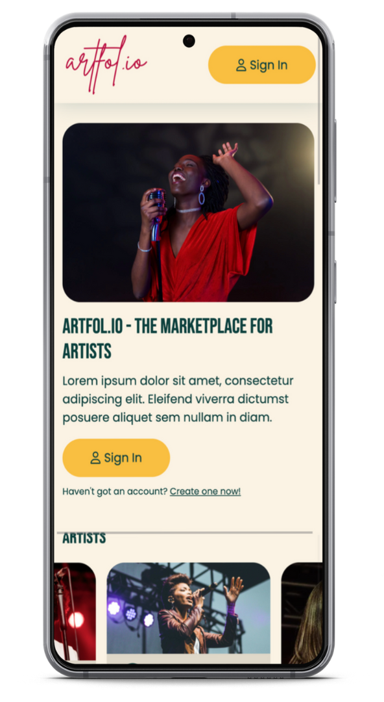

# Artfol.io - https://artfol-io.herokuapp.com/




## Description

A marketplace for artists where they can showcase their talent, connecting them to their next gig. Users can sign up as an artist or looking for an artist. Artists can showcase their work and those looking for one can find someone suitable for their event. Once a request has been made and accepted, they can exchange details via the chatbox to arrange the gig.

---

## Installation & Usage

### Live App

[https://artfol-io.herokuapp.com/](https://artfol-io.herokuapp.com/)

### Local

1. Clone the repo
   ```sh
   git clone https://github.com/Harkins12345/Artfolio-Lap-4-Project.git
   ```
2. Install npm packages in client folder
   ```sh
   cd client
   npm install
   npm run build
   ```
3. Move `build` folder from client to server folder

4. Rename `build` in server folder to `react-build`
   ```sh
   mv build react-build
   ```
5. Install pipenv packages
   ```sh
   pipenv shell
   pipenv install
   pipenv run dev
   ```
   ***

## Planning & Delivery

### Defining MVP

- Defined the core requirements of the application and added each requirement as tickets in a trello board
- Went through each ticket as a team to ensure we are all aligned with the requirments and how we intend to tackle the ticket

### Communication

- We used Slack as the single method of communication on this project
- Worked on individual branches and merged to main once it was communicated with the rest of the team
- Single point of truth for this application was stored on Figma
- Planned regular catch up sessions throughout the day for updates on tickets and whether we need to re-align/re-distribute work

### UX/UI Planning

- Found a few examples of similar journalling websites and took screenshots
- Using Figma, went through website examples and discussed likes/dislikes as a team
- Created brand guidelines and designs

---

## Testing

- 75% Test Coverage

- 80+ Tests

### Significant Code

Retrieving the files from the database, we dont have to store the files locally or outsource from another website.


---

## Technologies

- HTML/CSS
- JavaScript
- React
- Python
- MongoDB

---

## Bugs

- [ ] CSS classnames inconsistencies
- [ ] Frontend testing
      -- jest coverage would occasionally stop working
- [ ] Accepting Request
      -- does not update the page once this is done, only seen once you leave the page
- [ ] New users have reviews

---

## Wins & Challenges

### Wins

- 100% Front End Testing Coverage
- 65% Back End Testing Coverage
- Python backend
- Created a react-app and connected to database
- App has permanent storage
- Have a live chatroom
- Authentication
- Responsiveness
- Deployed on heroku
- Ability to upload images, videos and audio files

### Challenges

- Backend testing
  -- Setting up the dummy data
  -- Running the tests without sending requests to the actual database
- Time constraints
- Uploading files
- Using sockets for the chatroom
- Updating the profile
- Managing users interaction
  -- ability to send and accept requests from each other
- Creating the modals for incoming and outgoing requests
- React boostrap overwriting styling
- Styling without the final prototype
- Testing during development
- Undestanding react-bootsrap
- Making SignUp/Login toggle responsive

## Future features

- Payment Integration
- Customisable user profiles
- Chat Bot for FAQ
- Success Badges for being reliable, quality performer, quality client etc.

---

## Contributors

- [Albert Stoykov](https://github.com/AlbertStoykov)
- [Jianli Lin](https://github.com/jianli1028)
- [Michael Harkins-Meloy](https://github.com/Harkins12345)
- [Prishal Makwana](https://github.com/PrishalM)
- [Yusra Tahir](https://github.com/yusra-tahir)

---

# Licence

Copyright 2022

Permission is hereby granted, free of charge, to any person obtaining a copy of this software and associated documentation files (the "Software"), to deal in the Software without restriction, including without limitation the rights to use, copy, modify, merge, publish, distribute, sublicense, and/or sell copies of the Software, and to permit persons to whom the Software is furnished to do so, subject to the following conditions:

The above copyright notice and this permission notice shall be included in all copies or substantial portions of the Software.

THE SOFTWARE IS PROVIDED "AS IS", WITHOUT WARRANTY OF ANY KIND, EXPRESS OR IMPLIED, INCLUDING BUT NOT LIMITED TO THE WARRANTIES OF MERCHANTABILITY, FITNESS FOR A PARTICULAR PURPOSE AND NONINFRINGEMENT. IN NO EVENT SHALL THE AUTHORS OR COPYRIGHT HOLDERS BE LIABLE FOR ANY CLAIM, DAMAGES OR OTHER LIABILITY, WHETHER IN AN ACTION OF CONTRACT, TORT OR OTHERWISE, ARISING FROM, OUT OF OR IN CONNECTION WITH THE SOFTWARE OR THE USE OR OTHER DEALINGS IN THE SOFTWARE.
